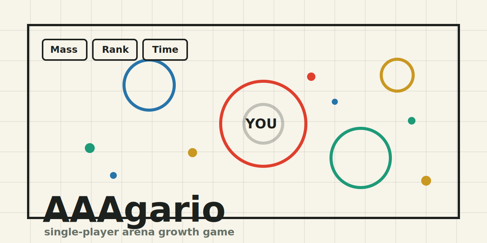

# AAAgario

[Play on GitHub Pages](https://hubertlim.github.io/AAAgario/)

AAAgario is a single-player browser arena game that blends the readable growth loop of Agar.io with the short-session routing pressure of Hole.io. Start tiny, eat motes, absorb smaller rivals, unlock bigger city props, and chase the cleanest route before the timer runs out.



## Highlights

- **Instant browser play** with no account, backend, or install step.
- **Short timed rounds** at 3, 5, or 10 minutes.
- **Smooth pointer, touch, WASD, and arrow-key controls** for desktop and mobile.
- **Custom player tag, color, and mark** so each run feels a little more yours.
- **Canvas-first performance** with one render surface, pooled objects, and viewport culling.
- **Static hosting friendly** for GitHub Pages, Docker, nginx, or any plain file server.

## Play Locally

Serve the folder with any static file server:

```powershell
python -m http.server 8080
```

Then open:

```text
http://localhost:8080
```

## Run With Docker

```powershell
docker compose up --build
```

Then open:

```text
http://localhost:8080
```

## GitHub Pages

This repo includes a GitHub Actions workflow at `.github/workflows/pages.yml`. On every push to `main`, it packages `index.html`, `src/`, and `docs/`, then deploys the game to GitHub Pages.

In the repository settings, set **Pages** to use **GitHub Actions** as the source.

## Project Structure

```text
.
├── index.html              # SPA shell and social metadata
├── src/
│   ├── main.js             # game loop, simulation, input, AI, rendering
│   └── styles.css          # responsive line-art UI
├── docs/social-preview.svg # GitHub and social preview artwork
├── scripts/smoke-check.cjs # Playwright smoke check for served builds
├── Dockerfile              # static nginx image
├── docker-compose.yml      # local container runner
└── nginx.conf              # SPA-friendly static server config
```

## Smoke Check

The smoke check expects the game to be running at `http://localhost:8080` from the host machine and uses Playwright to verify that the game starts, renders a nonblank canvas, and returns to the menu.

```powershell
node scripts/smoke-check.cjs
```

## Design Notes

- **Agar.io loop:** start tiny, collect pellets, eat smaller rivals, avoid larger rivals, and grow slower as mass increases.
- **Hole.io loop:** short timed runs, growth thresholds unlock bigger world objects, and optimal routing matters.
- **UI direction:** crisp line art, large touch targets, minimal HUD, and immediate play.

## Roadmap

- Add persistent best scores with `localStorage`.
- Add sound effects and haptic feedback for collection chains.
- Add more prop tiers and map landmarks.
- Add a pause overlay with restart and settings controls.
- Capture automated screenshots for releases.
